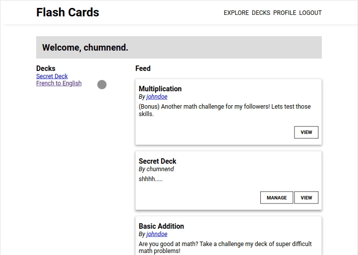

# Flashcards
A web app for creating and managing flashcards, built using **Django/Python**. The idea of this 
project was to experiment with building a social media like application while also learning 
more about the Django ecosystem.

## Demo


## Development Setup

### Prerequisites
- Python 3
- Pip
- virtualenv
- Postgresql

### Configuration
1) Clone the repo

2) Setup virtual environment,
```
python3 -m virtualenv venv
source venv/bin/activate
```

3) Install dependencies,
```
pip install -r requirements.txt
```

4) Copy env.example into .env file and fill it out,
```
cp env.example .env
```

```
# .env example
SECRET_KEY=secret
DATABASE_URL=postgres://<db_user>:<db_password>@127.0.0.1:5432/<db_name>
ALLOWED_HOSTS=*
EMAIL_BACKEND=django.core.mail.backends.console.EmailBackend
EMAIL_HOST=
EMAIL_PORT=
EMAIL_HOST_USER=
EMAIL_HOST_PASSWORD=
EMAIL_USE_TLS=
```

5) Change to source directory,
```
cd src/
```

6) Collect staticfiles,
```
python manage.py collectstatic
```

7) Run any migrations,
```
python manage.py migrate
```

8) Start the app,
```
python manage.py runserver <PORT>
```

### Test
```
python manage.py test
```

### Scripts
The `run.sh` script can be used to automatically collect static files, migrate 
the database and run the app in one console call,
```
./run.sh
```

## Deployment
Application is deployed to Heroku upon push to stable branch
